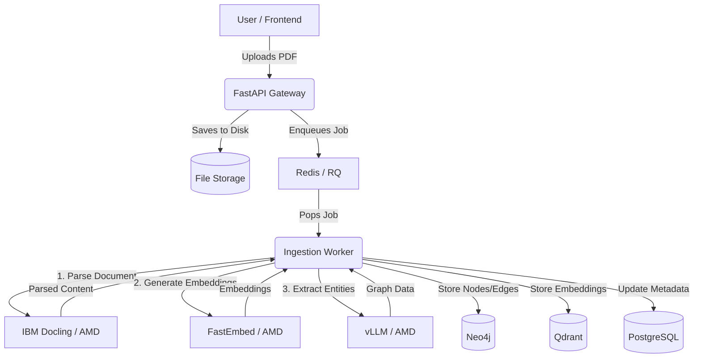
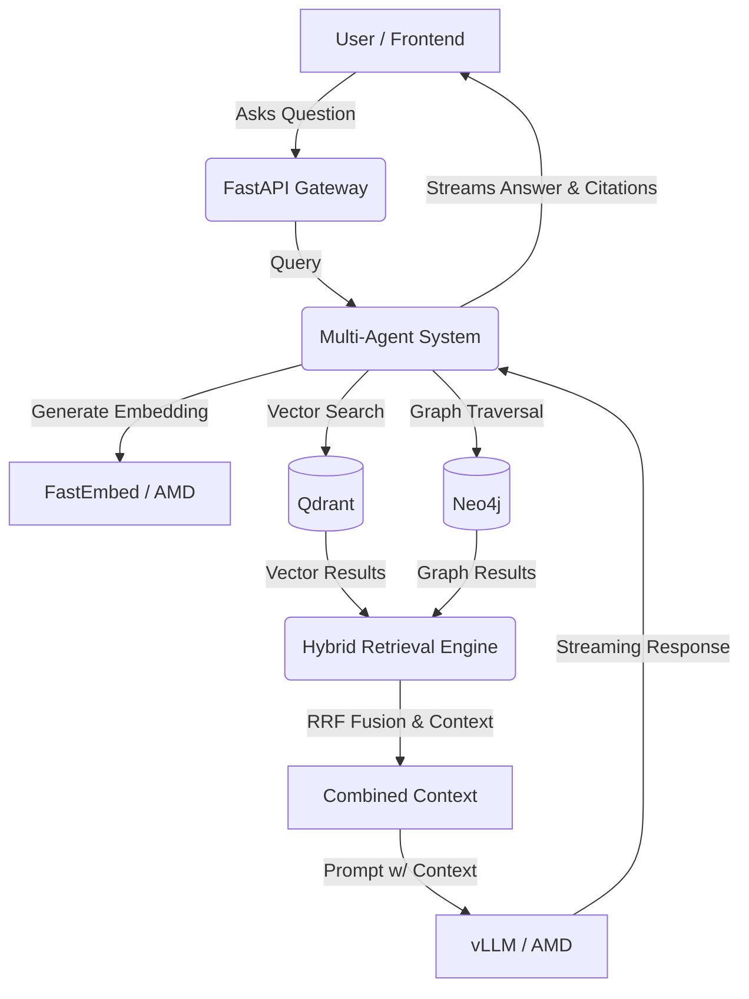

<div align="center">


# Cortex

> **AI Operating System for Industrial Knowledge**

Turn scattered industrial documents into a searchable knowledge graph and talk to them using a multi-agent AI copilot with complete citations.

🏆 **AMD Developer Hackathon 2026 – Unicorn Track**

🌐 **Live Demo:** [https://cortex-search-ai.vercel.app](https://cortex-search-ai.vercel.app)  
🎥 **Demo Video:** *(link)*  
📄 **Pitch Deck:** *(link)*

</div>

---

## 🚀 Why Cortex?

Traditional RAG retrieves text.  
**Cortex retrieves knowledge.**

We combine:
- **Knowledge Graphs**
- **Hybrid Retrieval**
- **Multi-Agent Reasoning**

To answer complex questions that no single document contains.

---

## 📸 Screenshots

*(Replace with actual screenshots before submission)*

| Home Page / Graph Explorer | Document Upload |
| :---: | :---: |
| `[Screenshot 1]` | `[Screenshot 2]` |
| **Copilot Chat** | **System Architecture** |
| `[Screenshot 3]` | `[Screenshot 4]` |

---

## ✨ Features

- ✅ **Layout-aware PDF parsing**
- ✅ **Hybrid Retrieval** (Dense + Graph + Lexical)
- ✅ **Knowledge Graph Construction**
- ✅ **Multi-Agent Reasoning**
- ✅ **Streaming Responses**
- ✅ **Source Citations**
- ✅ **Industrial Knowledge Graph**
- ✅ **JWT Authentication**
- ✅ **Self-Healing Queue**
- ✅ **Production-grade Backend**

---

## ⚡ Built on AMD

Embedding, chunking, parsing, generation, retrieval - all AI-related components were offloaded to AMD GPU notebooks and were accessed through ngrok tunnels.

| Task | Technology |
|------|------------|
| **LLM Inference** | ROCm + vLLM |
| **OCR / Parsing** | IBM Docling |
| **Embeddings** | FastEmbed |
| **GPU Platform** | AMD AI Notebooks |
| **API Boundary** | OpenAI Compatible |

**Why this matters:**
- Zero code changes between OpenAI and AMD inference.
- Complete offloading of heavy ML components to dedicated AMD hardware.
- Ready for secure, on-premise enterprise deployments.

The AMD AI Notebook exposes unified AI endpoints via ngrok tunnels, which are consumed natively by the Cortex backend.

---

## 🏗️ Architecture

```text
        Next.js (Frontend)
               ↓
      FastAPI (API Gateway)
               ↓
    RQ Workers (Async Queue)
               ↓
     Hybrid Retrieval Engine
               ↓
   Multi-Agent Reasoning (P3)
               ↓
 +--------------------------+
 |  Qdrant | Neo4j | Postgres |
 +--------------------------+
               ↓
    AMD ROCm + vLLM (Compute)
```

---

## 📊 Data Flow Diagrams

### 1. File Upload to Graph Generation (Ingestion)



### 2. Query Retrieval Pipeline



---

## 🔄 Demo Flow

**Upload PDF** ➔ **Graph Builds** ➔ **Ask Question** ➔ **Get Cited Answer** ➔ **Explore Graph**

---

## 🛠️ Tech Stack

| Layer      | Tech            |
| ---------- | --------------- |
| **Frontend**   | Next.js 16      |
| **Backend**    | FastAPI         |
| **Vector DB**  | Qdrant          |
| **Graph DB**   | Neo4j           |
| **Metadata**   | PostgreSQL      |
| **Queue**      | Redis + RQ      |
| **AI Compute** | AMD ROCm + vLLM |
| **OCR**        | IBM Docling     |
| **Embeddings** | FastEmbed       |

---

## 📂 Repository Structure

Judges, start here to navigate the codebase:

```text
cortex/
├── backend/
│   ├── ingestion_worker/  # P1: Parsing, embedding, and KG extraction
│   ├── app/retrieval/     # P2: Hybrid Retrieval (Dense, Lexical, Graph)
│   ├── app/agents/        # P3: LangGraph Multi-Agent System
│   └── fabric_api/        # FastAPI Application Layer
├── frontend/              # Next.js User Interface
├── scripts/               # Deployment and utility scripts
├── notebooks/             # AMD AI Notebooks for vLLM deployment
├── docs/                  # Architecture & Design Specs
└── docker-compose.yml     # Local Infrastructure
```

### 📍 Where to Look
- 📂 **`backend/ingestion_worker`** → Knowledge Graph Construction
- 📂 **`backend/app/retrieval`** → Hybrid Retrieval Engine & RRF Fusion
- 📂 **`backend/app/agents`** → LangGraph Multi-Agent System

---

## 💻 Setup Instructions

### Prerequisites
- Python 3.11+
- Node.js 20+
- Docker & Docker Compose
- AMD AI Notebook

### 1. AMD Notebook Setup
Upload `cortex_unified_notebook.ipynb` to the AMD AI Notebooks platform. Run the cells to expose the unified ML gateway endpoints via Ngrok. 

### 2. Infrastructure (Docker)
```bash
docker compose up -d
```

### 3. Backend Setup
```bash
cd backend
cp .env.example .env
uv venv
source .venv/bin/activate
uv pip install -e ".[dev]"
alembic upgrade head
uv run uvicorn backend.fabric_api.main:app --reload --port 8000
```

### 4. Ingestion Worker
*(In a separate terminal)*
```bash
cd backend
uv run python -m backend.ingestion_worker.main
```

### 5. Frontend Setup
```bash
cd frontend
cp .env.example .env
npm install
npm run dev
```

---

## 🔐 Environment Variables

**Backend (`backend/.env`)**
| Variable           | Description |
| ------------------ | ----------- |
| `LLM_BASE_URL`       | AMD Gateway endpoint |
| `REMOTE_PARSER_URL`  | Remote Docling endpoint |
| `EMBEDDING_ENDPOINT` | Remote FastEmbed endpoint |
| `DATABASE_URL`       | PostgreSQL connection |
| `NEO4J_URI`          | Graph database connection |
| `ENABLE_AUTH`        | Set `true` for JWT |

**Frontend (`frontend/.env`)**
| Variable            | Description |
| ------------------- | ----------- |
| `NEXT_PUBLIC_API_URL` | Backend URL (e.g. `http://localhost:8000`) |

---

## 🛡️ Security

Cortex is built with enterprise security in mind:
- **JWT Authentication** (RS256, Remote JWKS)
- **Cypher Injection Protection** (Strict Regex sanitization)
- **Parameterized SQL**
- **Row-level locking** for concurrency
- **Background job retries** via RQ
- **DLQ recovery daemons**
- **Strongly Typed APIs** (Pydantic)

---

## 🌍 Production Deployment

| Service | Hosted On |
|---------|-----------|
| **Frontend** | Vercel |
| **Backend API** | Render |
| **ML Gateway** | AMD AI Notebooks |
| **Vector DB** | Qdrant Cloud |
| **Graph DB** | Neo4j AuraDB |
| **Relational DB** | Neon Postgres |

---

## 🔮 Roadmap

- [ ] Kafka Integration for high-throughput ingestion
- [ ] Comprehensive Observability (Prometheus + OpenTelemetry)
- [ ] Fine-grained Server-side RBAC
- [ ] P&ID Vision (Piping and Instrumentation Diagrams)
- [ ] Industrial Vision-Language Models (VLM)
- [ ] Advanced Graph Analytics
