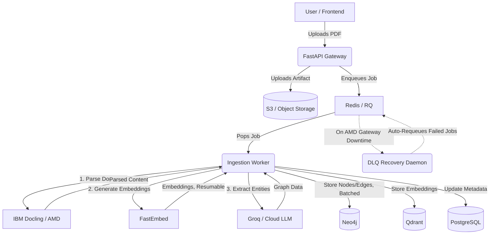
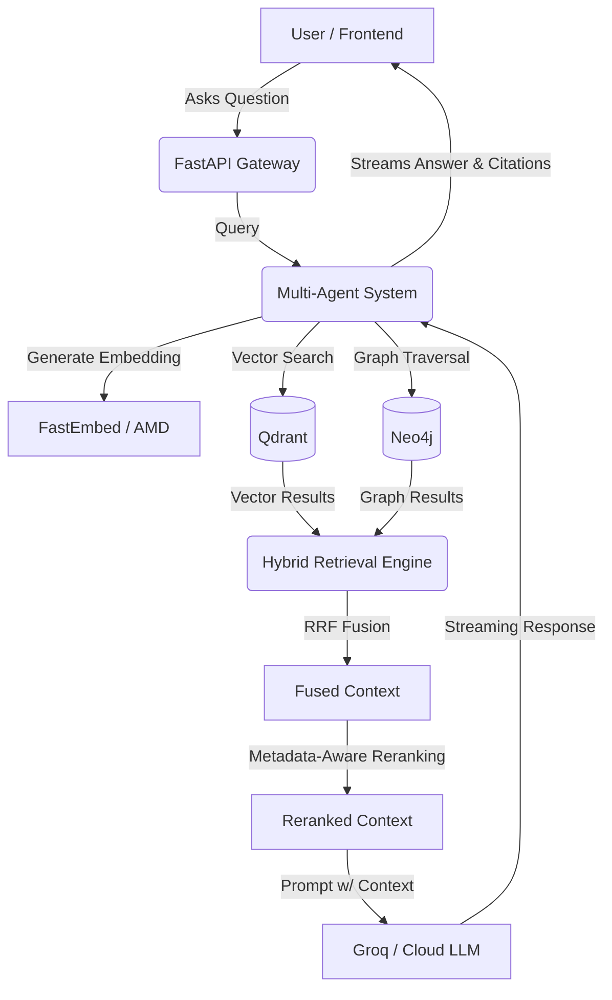

<div align="center">


# Cortex

> **AI Operating System for Industrial Knowledge**

Turn scattered industrial documents into a searchable knowledge graph and talk to them using a multi-agent AI copilot with complete citations.

**AMD Developer Hackathon 2026 – Unicorn Track**

**Live Demo:** [https://cortex-search-ai.vercel.app](https://cortex-search-ai.vercel.app)

</div>

---

## Why Cortex?

Traditional RAG retrieves text.
**Cortex retrieves knowledge.**

We combine:
- **Knowledge Graphs**
- **Hybrid Retrieval**
- **Multi-Agent Reasoning**

To answer complex questions that no single document contains.

---

## Features

- **Layout-aware PDF parsing**
- **Hybrid Retrieval** (Dense + Graph + Lexical exact-match pathway)
- **Metadata-Aware Reranking** to surface primary sources over secondary references
- **Knowledge Graph Construction** with open, domain-adaptive entity/relationship extraction
- **Multi-Agent Reasoning** (LangGraph Supervisor with specialist workers)
- **Streaming Responses** (Robust SSE with agent tracing, reasoning, and tool executions)
- **Source Citations**
- **Industrial Knowledge Graph**
- **Self-Healing Queue** with automatic Dead Letter Queue recovery
- **Resumable, Idempotent Ingestion** (embedding jobs recover cleanly from partial failure)
- **S3-Compatible Object Storage** with local-disk fallback for development
- **Production-Ready Backend** (Hardened with session continuity, async graceful shutdown, and container healthchecks)

---

## High-Speed Inference & Flexible ML Architecture

Embedding, chunking, parsing, generation, and retrieval-time reasoning are cleanly decoupled. Cortex delegates heavy multi-agent reasoning to high-speed cloud inference providers (like **Groq**) to eliminate network tunnel latency, while keeping document parsing and embeddings flexible (running locally or via dedicated microservices).

| Task | Technology |
|------|------------|
| **LLM Inference** | Groq / OpenAI Compatible API |
| **OCR / Parsing** | IBM Docling |
| **Embeddings** | FastEmbed |
| **API Boundary** | Standardized OpenAI Interface |

**Why this matters:**
- **Zero code changes** required to switch between local vLLM, Groq, Fireworks, or OpenAI.
- **Eliminates TCP/ngrok bottlenecks**, allowing the LangGraph agents to reason and stream at maximum token-per-second limits.
- **Robust Ingestion:** The background recovery daemon polls endpoints and automatically requeues any ingestion jobs from the Redis Dead Letter Queue if network interruptions occur.

---

## Architecture

```text
        Next.js (Frontend)
               ↓
   FastAPI (API Gateway)
               ↓
    RQ Workers (Async Queue + DLQ Recovery)
               ↓
     Hybrid Retrieval Engine (RRF + Reranking)
               ↓
   Multi-Agent Reasoning (P3)
               ↓
 +-----------------------------------+
 | Qdrant | Neo4j | Postgres | S3 |
 +-----------------------------------+
               ↓
    Groq / Cloud LLM (High-Speed Inference)
```

---

## Data Flow Diagrams

### 1. File Upload to Graph Generation (Ingestion)



### 2. Query Retrieval Pipeline



---

## Demo Flow

**Upload PDF** ➔ **Graph Builds** ➔ **Ask Question** ➔ **Get Cited Answer** ➔ **Explore Graph**

---

## Tech Stack

| Layer      | Tech            |
| ---------- | --------------- |
| **Frontend**   | Next.js 16      |
| **Backend**    | FastAPI         |
| **Vector DB**  | Qdrant          |
| **Graph DB**   | Neo4j           |
| **Metadata**   | PostgreSQL      |
| **Object Storage** | S3-Compatible (boto3) |
| **Queue**      | Redis + RQ (with DLQ recovery) |
| **AI Compute** | Groq / Any OpenAI-Compatible API |
| **OCR**        | IBM Docling     |
| **Embeddings** | FastEmbed       |

---

## Repository Structure

Judges, start here to navigate the codebase:

```text
cortex/
├── backend/
│   ├── ingestion_worker/  # P1: Parsing, embedding, and KG extraction
│   ├── app/retrieval/     # P2: Hybrid Retrieval (Dense, Lexical, Graph) + Reranking
│   ├── app/agents/        # P3: LangGraph Multi-Agent System
│   ├── shared/            # Config, DB clients, JWT verification, object storage
│   └── fabric_api/        # FastAPI Application Layer + DLQ Recovery Daemon
├── frontend/              # Next.js User Interface
├── scripts/                # Deployment and utility scripts
├── *.ipynb                # AMD AI Notebooks for the unified ML gateway
├── docs/                  # Architecture & Design Specs
└── docker-compose.yml     # Local Infrastructure
```

### Where to Look
- **`backend/ingestion_worker`** → Knowledge Graph Construction
- **`backend/app/retrieval`** → Hybrid Retrieval Engine, RRF Fusion, and Reranking
- **`backend/app/agents`** → LangGraph Multi-Agent System
- **`backend/fabric_api/dlq_recovery.py`** → Self-Healing Queue Recovery

---

## Setup Instructions

### Prerequisites
- Python 3.11+
- Node.js 20+
- Docker & Docker Compose
- AMD AI Notebook

### 1. AMD Notebook Setup
Upload `cortex_unified_notebook.ipynb` to the AMD AI Notebooks platform. Run the cells to expose the unified ML gateway endpoints via Ngrok. 

### 2. Infrastructure (Docker)
```bash
docker compose up -d
```

### 3. Backend Setup
```bash
cd backend
cp .env.example .env
uv venv
source .venv/bin/activate
uv pip install -e ".[dev]"
alembic upgrade head
uv run uvicorn backend.fabric_api.main:app --reload --port 8000
```

### 4. Ingestion Worker
*(In a separate terminal)*
```bash
cd backend
uv run python -m backend.ingestion_worker.main
```

### 5. Frontend Setup
```bash
cd frontend
cp .env.example .env
npm install
npm run dev
```

---

## Environment Variables

**Backend (`backend/.env`)**
| Variable | Description |
|----------|-------------|
| `CORS_ORIGINS` | Comma-separated list of allowed frontend origins for CORS |
| `DATABASE_URL` | PostgreSQL connection string |
| `DEBUG` | Enable debug mode (`true`/`false`) |
| `EMBEDDING_MODEL` | Embedding model name |
| `EMBEDDING_MODEL_ENDPOINT` | Embedding model API endpoint | (AMD AI Notebook tunneled via ngrok)
| `FAST_MODEL` | Lightweight LLM used for fast responses |
| `FAST_MODEL_API_KEY` | API key for the fast LLM |
| `FAST_MODEL_BASE_URL` | Base URL of the fast LLM provider | (e.g. Groq, Fireworks, OpenAI)
| `LLM_API_KEY` | API key for the primary LLM |
| `LLM_BASE_URL` | Base URL of the primary LLM provider | (e.g. Groq, Fireworks, OpenAI)
| `LLM_MODEL` | Primary LLM model name | 
| `NEO4J_PASSWORD` | Neo4j database password |
| `NEO4J_URI` | Graph database connection URI |
| `NEO4J_USER` | Neo4j database username |
| `PROJECT_NAME` | Application name |
| `QDRANT_API_KEY` | Qdrant Cloud API key (optional for local instances) |
| `QDRANT_COLLECTION` | Qdrant collection name |
| `QDRANT_URL` | Qdrant server URL |
| `REDIS_URL` | Redis connection URL |
| `REMOTE_PARSER_URL` | Remote Docling parser endpoint | (Optional, for delegated extraction)
| `S3_ACCESS_KEY_ID` | S3-compatible storage access key |
| `S3_BUCKET_NAME` | S3 bucket name |
| `S3_ENDPOINT_URL` | S3-compatible storage endpoint |
| `S3_REGION` | S3 bucket region |
| `S3_SECRET_ACCESS_KEY` | S3-compatible storage secret key |

**Frontend (`frontend/.env`)**
| Variable | Description |
|----------|-------------|
| `NEXT_PUBLIC_API_URL` | Base URL of the backend API |
| `NEXT_PUBLIC_API_PREFIX` | Versioned API path prefix |
| `NEXT_PUBLIC_APP_NAME` | Application name displayed in the UI |
| `NEXT_PUBLIC_DEFAULT_ENTITY` | Default entity shown in the knowledge graph |
| `NEXT_PUBLIC_DEFAULT_GRAPH_DEPTH` | Default graph traversal depth (number of hops) |
| `NEXT_PUBLIC_MAX_UPLOAD_MB` | Maximum file upload size (MB) |
| `NEXT_PUBLIC_REQUEST_TIMEOUT_MS` | Timeout for non-streaming API requests (ms) |

---

## Production Deployment

| Service | Hosted On |
|---------|-----------|
| **Frontend** | Vercel |
| **Backend API** | Render |
| **LLM Inference** | Groq Cloud API |
| **ML Gateway (Parsing & Embeds)** | Render / Local Container |
| **Vector DB** | Qdrant Cloud |
| **Graph DB** | Neo4j AuraDB |
| **Relational DB** | Neon Postgres |
| **Cache** | Redis |
| **Object Storage** | Supabase S3-Compatible Storage |

---

## Roadmap

- [ ] Kafka Integration for high-throughput ingestion
- [ ] Comprehensive Observability (Prometheus + OpenTelemetry)
- [ ] Fine-grained Server-side RBAC
- [ ] P&ID Vision (Piping and Instrumentation Diagrams)
- [ ] Industrial Vision-Language Models (VLM)
- [ ] Advanced Graph Analytics
