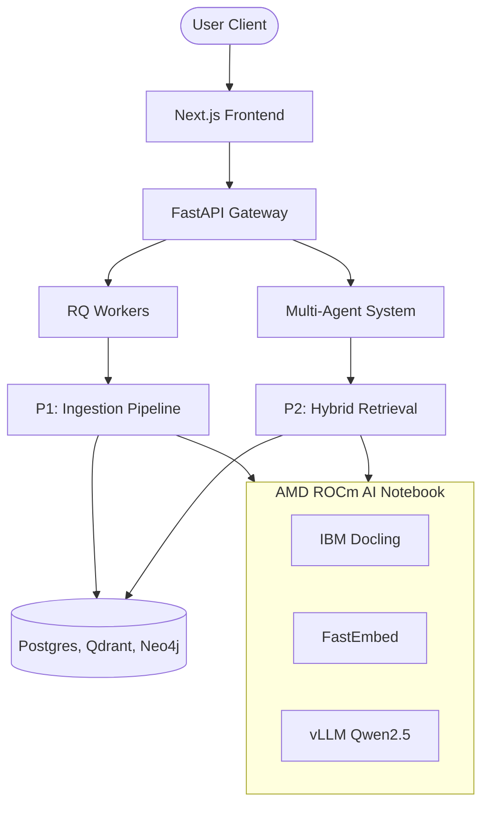

<div align="center">


# Cortex

> **Cortex is a production-grade AI Operating System for industrial documents. It transforms PDFs into a Knowledge Graph and enables engineers to query them using hybrid retrieval and multi-agent reasoning with fully cited answers.**

🏆 **AMD Developer Hackathon 2026 – Unicorn Track**

| Resource | Link |
| --- | --- |
| 🌐 Live Demo | [https://cortex-search-ai.vercel.app](https://cortex-search-ai.vercel.app) |
| 🎥 Demo Video | *(link)* |
| 📑 Pitch Deck | *(link)* |
| 🏗 Architecture | [docs/p3_architecture.md](docs/p3_architecture.md) |

</div>

---

## 🚨 Problem

Industrial organizations store thousands of engineering manuals, maintenance reports, operating procedures, and technical documents. Traditional search retrieves isolated text snippets, making multi-document reasoning difficult and slowing engineers during troubleshooting.

## 💡 Solution

Cortex transforms documents into a structured Knowledge Graph, performs hybrid retrieval across vectors and graph relationships, and orchestrates multiple AI agents to generate fully cited answers.

---

## 📸 Demo

*(Add a GIF here before submission)*
```text
Upload PDF  ➔  Graph builds  ➔  Ask question  ➔  Answer streams  ➔  Open graph
```

---

## 🧠 Why Cortex?

| Traditional RAG | Cortex |
| --- | --- |
| Retrieves chunks | Retrieves structured knowledge |
| Limited context | Multi-hop reasoning |
| Single-agent | LangGraph multi-agent |
| Flat embeddings | Knowledge Graph + Vector DB |
| Weak provenance | Full citations |

---

## ✨ Features

### 🤖 AI
* **Knowledge Graph Construction**: Extracts entities and relationships via LLMs.
* **Multi-Agent Reasoning**: Copilot, Supervisor, and Specialist Workers.
* **Hybrid Retrieval**: Fuses Dense, Graph Traversal, and Lexical search via RRF.
* **Streaming Generation**: Sub-second time-to-first-token.

### ⚙️ Infrastructure
* **Async RQ Workers**: Resilient background ingestion pipelines.
* **JWT Authentication**: Secure API endpoints with remote JWKS verification.
* **DLQ Recovery**: Auto-recovers jobs if ML inference endpoints drop.
* **Production APIs**: Strictly typed FastAPI with structured logging.

---

## 🏗️ Architecture



---

## ⚡ Built on AMD

Every machine learning workload in Cortex runs exclusively on AMD GPUs.

```text
       AMD GPU
          ▼
+--------------------+
| IBM Docling        |
+--------------------+
          ▼
+--------------------+
| FastEmbed          |
+--------------------+
          ▼
+--------------------+
| vLLM (Qwen2.5)     |
+--------------------+
          ▼
 OpenAI-compatible API
          ▼
   Cortex Backend
```

**Why this matters:**
- Zero code changes between OpenAI and AMD inference.
- Entire ML stack runs locally on AMD GPUs.
- Ready for secure, on-premise enterprise deployments.

The AMD AI Notebook exposes a unified OpenAI-compatible inference endpoint that is consumed natively by the Cortex backend.

---

## 📂 Repository Structure

```text
cortex/
├── backend/
│   ├── ingestion_worker/
│   ├── app/retrieval/
│   ├── app/agents/
│   └── fabric_api/
├── frontend/
├── scripts/
├── notebooks/
├── docs/
└── docker-compose.yml
```

⭐ **Main implementation starts in:**
- 📂 `backend/ingestion_worker/` (Graph Construction)
- 📂 `backend/app/retrieval/` (Hybrid Retrieval)
- 📂 `backend/app/agents/` (LangGraph Agents)

---

## 💻 Setup Instructions

### Prerequisites
- Python 3.11+
- Node.js 20+
- Docker & Docker Compose
- AMD AI Notebook

### 1. AMD Notebook Setup
Upload `cortex_unified_notebook.ipynb` to the AMD AI Notebooks platform. Run the cells to expose the unified ML gateway endpoints via Ngrok. 

### 2. Infrastructure (Docker)
```bash
docker compose up -d
```

### 3. Backend Setup
```bash
cd backend
cp .env.example .env
uv venv
source .venv/bin/activate
uv pip install -e ".[dev]"
alembic upgrade head
uv run uvicorn backend.fabric_api.main:app --reload --port 8000
```

### 4. Ingestion Worker
*(In a separate terminal)*
```bash
cd backend
uv run python -m backend.ingestion_worker.main
```

### 5. Frontend Setup
```bash
cd frontend
cp .env.example .env
npm install
npm run dev
```

---

## 🔐 Environment Variables

**Backend (`backend/.env`)**
| Variable | Description |
| --- | --- |
| `LLM_BASE_URL` | AMD Gateway endpoint |
| `REMOTE_PARSER_URL` | Remote Docling endpoint |
| `EMBEDDING_ENDPOINT` | Remote FastEmbed endpoint |

**Frontend (`frontend/.env`)**
| Variable | Description |
| --- | --- |
| `NEXT_PUBLIC_API_URL` | Backend URL |

---

## 🛡️ Production Hardened

✅ **RS256 JWT**
✅ **Row-level DB locking**
✅ **Cypher Injection Mitigation**
✅ **Typed APIs**
✅ **Background Recovery**

---

## 🌍 Production Deployment

| Layer | Platform |
| --- | --- |
| **Frontend** | Vercel |
| **Backend** | Render |
| **GPU** | AMD AI Notebook |
| **Graph** | AuraDB |
| **Vector** | Qdrant Cloud |
| **Metadata** | Neon |

---

## 📊 Performance

✓ **<2s document ingestion** (small PDFs)
✓ **Streaming answers**
✓ **Graph extraction**
✓ **Hybrid retrieval**
✓ **Production async pipeline**
✓ **Fully cited responses**

---

## 🔮 Future Roadmap

- [ ] Kafka Integration
- [ ] Comprehensive Observability (Prometheus + OpenTelemetry)
- [ ] Fine-grained Server-side RBAC
- [ ] Industrial Vision-Language Models (VLM)

---

## License

MIT