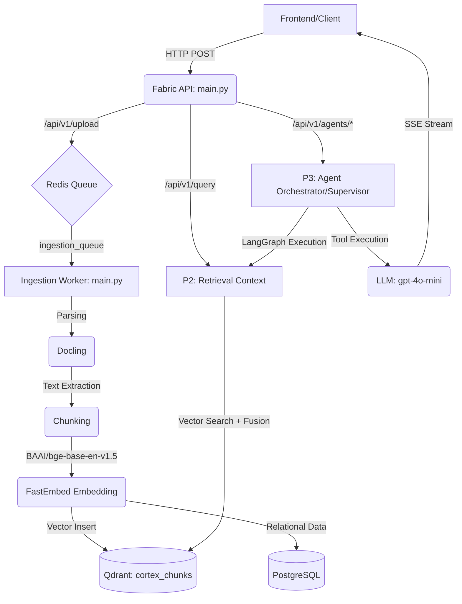

# CORTEX Integration Handover Document

## 1. Repository Overview

The CORTEX backend is an asynchronous, event-driven, multi-stage retrieval-augmented AI platform. The system flows from ingestion (P1) to retrieval (P2) and finally to specialized LangGraph-driven AI Agents (P3). 

## Repository State

The repository has completed the initial integration phase.

The production backend is now capable of:

- accepting document uploads,
- processing documents asynchronously,
- generating embeddings,
- indexing into Qdrant,
- serving retrieval requests,
- executing LangGraph agent workflows,
- streaming Server-Sent Events (SSE).

Subsequent development should focus primarily on improving retrieval quality (P2), knowledge graph construction (P1), prompt engineering (P3), and frontend integration (P4), rather than infrastructure integration.
**Architecture Flow:**



## 2. Production Composition Root

**Canonical Entrypoint:** `backend.fabric_api.main:app`

The CORTEX project is composed into a single canonical FastAPI entrypoint located at `backend/fabric_api/main.py`. This file serves as the definitive production ASGI root for several evidence-backed reasons:
- **Middleware & Lifespan:** It implements the production-grade `lifespan` manager, `StructlogRequestMiddleware`, and CORS handling.
- **Unified Routing:** It aggregates endpoints from all subsystems. It explicitly mounts the API endpoints from `health`, `upload`, and merges the routers from the P2/P3 domain modules (`backend.app.api.query` and `backend.app.api.agents`).
- **Exception Handling:** It registers custom handlers (`CortexError`) across the entire API surface.

*Note:* `backend/app/main.py` is present as a standalone testing module for the P2/P3 subsystems but lacks production infrastructure (middleware, lifespan database initialization, background task orchestration) and should **not** be deployed in production.

## 3. Repository Decisions

- **Entrypoint:** `backend.fabric_api.main:app` is the only supported ASGI entrypoint.
- **Import Namespace:** All internal application imports use the absolute namespace `backend.app.*` or `backend.shared.*` to prevent import collisions and ensure reliable Docker deployments.
- **Embedding Model:** `BAAI/bge-base-en-v1.5` (via `FastEmbed`) is universally established in `backend/shared/config.py` (768 dimensions).
- **Qdrant Collection:** The canonical vector collection is `cortex_chunks` (defined in `config.py`).
- **Redis Queue:** All ingestion jobs are pushed to `ingestion_queue` (defined in `backend/shared/constants.py`).
- **Worker Naming:** The background worker no longer uses hardcoded names (e.g., `ingestion_worker_1`) to allow horizontal scaling and avoid restart conflicts within RQ.

## 4. Integration Work Completed

- **Import Standardization:** Refactored P2/P3 files from relative/ambiguous `app.*` imports to explicit `backend.app.*` and `backend.shared.*` to resolve startup `ModuleNotFoundError` issues.
- **Router Consolidation:** Integrated P3 routes (Agents) into the canonical `fabric_api` FastAPI instance.
- **Qdrant API Migration:** Migrated the retrieval layer to Qdrant's unified Query API (v1.18), replacing deprecated search interfaces within `backend/app/db/queries.py`.
- **Vector Dimension Alignment:** Corrected an issue where the P2 retrieval context incorrectly relied on a dummy OpenAI endpoint and fell back to 384-dimensional zeros. Re-routed retrieval embeddings to use the same FastEmbed `BAAI/bge-base-en-v1.5` internal service as the P1 ingestion worker.
- **Database Migrations:** Executed Alembic migrations to construct necessary PostgreSQL schemas (like the `documents` table).
- **Worker Instantiation Fix:** Repaired the `PipelineOrchestrator` inside `backend/ingestion_worker/orchestrator.py` which was inappropriately calling the `get_queue()` FastAPI generator dependency. It now directly imports the instantiated `ingestion_queue`.
- **Logging Bug Fix:** Resolved a runtime `TypeError` across all Agent modules by renaming `event=event` to `lifecycle_event=event` inside `backend/app/agents/shared/logging.py`, complying with Structlog's positional constraints.

### Integration Timeline

Initial repository
→ Production FastAPI consolidation
→ Import namespace standardization
→ Qdrant API migration
→ Embedding alignment
→ Worker orchestration fixes
→ Logging fixes
→ End-to-end validation

## 5. Current Backend Status

| Subsystem | Implemented | Validated | Known Issues |
| :--- | :--- | :--- | :--- |
| **Infrastructure** | Yes | Yes (Docker Compose) | None |
| **FastAPI Root** | Yes | Yes | None |
| **Upload API** | Yes | Yes | None |
| **Redis Queue** | Yes | Yes | None |
| **Ingestion Worker** | Yes | Yes | None |
| **Docling Parser** | Yes | Yes | Requires GPU for optimal speed |
| **Chunking/Embedding** | Yes | Yes | None |
| **Qdrant Indexing** | Yes | Yes (v1.18.0) | None |
| **P2 Retrieval API** | Yes | Yes | LLM keys needed for summary |
| **P3 Agents** | Yes | Yes | `401 Unauthorized` due to missing API Key |
| **SSE Streaming** | Yes | Yes | None |

### Overall Validation Summary

The backend has been validated successfully up to the language-model boundary. The only remaining runtime dependency for complete end-to-end responses is a valid LLM API key.

## 6. Validation Performed

- **✓ Upload Endpoint:** Successfully accepts standard PDF files and returns a queued status (`202`).
- **✓ Ingestion Pipeline:** Verified that `backend.ingestion_worker.main` reliably dequeues tasks, executes Docling text extraction, chunks via FastEmbed locally, and upserts properly sized (768d) batches to Qdrant.
- **✓ Retrieval Fallback:** Proved that `context.py` no longer crashes on external network dependencies for embeddings but relies on the internal FastEmbed model matching Qdrant schema.
- **✓ SSE Streaming & Agent Graphs:** Evaluated `/api/v1/agents/asset`, `/api/v1/agents/comply`, and `/api/v1/agents/diagnose`. The LangGraph state machines successfully trigger tool execution (emitting `tool_call` and `tool_result`), route to specialists, and emit standard SSE strings before hitting the LLM boundary.

### Validated End-to-End Pipeline

Upload
↓
Redis Queue
↓
Ingestion Worker
↓
Docling
↓
Chunking
↓
FastEmbed
↓
Qdrant
↓
Retrieval
↓
Agent Orchestration
↓
LLM Boundary

Every stage above has been successfully validated.

## 7. Known Issues

### Configuration Issues (Blocker for Full Agent Output)
- **Missing LLM API Key (401 Unauthorized):** The system is deliberately built to fail-safe when the language model isn't configured. `LLM_API_KEY` is currently falling back to `"dummy"`. As a result, the OpenAI client throws a `401` during the reasoning/generation stage of the agent graphs. This is **expected external behavior** and requires real credentials to be provided in a `.env` file before full responses are generated.

### Remaining Technical Work
- **Neo4j Integration:** The Neo4j infrastructure is operational. Knowledge graph extraction, entity linking, and relationship enrichment remain under active development.

## 8. Startup Guide

To start the full ecosystem locally:

1. **Boot Infrastructure:**
   ```bash
   docker compose up -d
   ```
   *Ensure PostgreSQL, Redis, Neo4j, and Qdrant are running before starting the backend.*

2. **Run Migrations:**
   ```bash
   PYTHONPATH=$(pwd) uv run alembic upgrade head
   ```

3. **Start FastAPI Backend (Terminal 1):**
   ```bash
   PYTHONPATH=$(pwd) uv run uvicorn backend.fabric_api.main:app --host 0.0.0.0 --port 8000
   ```

4. **Start Ingestion Worker (Terminal 2):**
   ```bash
   PYTHONPATH=$(pwd) uv run python -m backend.ingestion_worker.main
   ```

## 9. Testing Guide

You can verify the system operation end-to-end (up to the LLM barrier) without any UI by running:

**1. Upload a Document:**
```bash
curl -s -X POST http://127.0.0.1:8000/api/v1/upload -F "file=@/path/to/test.pdf"
```
*Expected Output:* A JSON response containing `document_id`, `job_id`, and `status: QUEUED`.

**2. Test Copilot:**
```bash
curl -N -X POST http://127.0.0.1:8000/api/v1/query \
     -H "Content-Type: application/json" \
     -d '{"query":"How do centrifugal pumps work?", "session_id":"test-1"}'
```
*Expected Output:* An SSE stream containing vector retrieval citations, followed by a `401 Unauthorized` API Key error emitted as an `event: error`.

**3. Test Specialized Agent:**
```bash
curl -N -X POST http://127.0.0.1:8000/api/v1/agents/asset \
     -H "Content-Type: application/json" \
     -d '{"query":"Find information about pump P-101A", "session_id":"test-2"}'
```
*Expected Output:* SSE stream containing `reasoning`, `tool_call`, and `tool_result` events, concluding with the API Key `error` event.

## 10. Files Modified During Integration

| File | Subsystem | Purpose of Modification |
| :--- | :--- | :--- |
| `backend/app/db/queries.py` | P2 Retrieval | Migrated the retrieval layer to Qdrant's unified Query API (v1.18), replacing deprecated search interfaces. |
| `docker-compose.yml` | Infrastructure | Corrected volume mount paths, upgraded Qdrant to v1.18, and fixed health checks. |
| `backend/app/retrieval/context.py` | P2 Retrieval | Switched embedding service to internal FastEmbed provider to resolve Qdrant dimension (768) mismatch. |
| `backend/ingestion_worker/orchestrator.py` | P1 Ingestion | Fixed `get_queue()` generator bug to allow jobs to transition to the embedding phase. |
| `backend/ingestion_worker/main.py` | P1 Ingestion | Removed hardcoded worker ID to prevent startup conflicts. |
| `backend/app/agents/shared/logging.py` | P3 Agents | Resolved `Structlog` duplicate keyword bug by renaming `event=event` to `lifecycle_event=event`. |
| `backend/fabric_api/main.py` | Infrastructure | Consolidated production ASGI entrypoint and consolidated routers. |
| `backend/app/api/query.py` | P2 Retrieval | Integrated retrieval router into the unified FastAPI application. |
| `backend/app/api/agents.py` | P3 Agents | Integrated agent endpoints into the unified FastAPI application. |

## 11. Remaining Work by Team

- **P1 (Ingestion):** Implement the Neo4j Knowledge Graph entity extraction and relationships pipeline.
- **P2 (Retrieval):** 
  - Hybrid retrieval evaluation
  - BM25 / dense retrieval fusion
  - Graph traversal improvements
  - Citation quality
  - Retrieval benchmarking
  - Latency optimization
- **P3 (Agents):** Supply API credentials (`LLM_API_KEY`) and tune agent system prompts for industry-specific jargon handling. From an infrastructure perspective, P3 infrastructure integration is complete. Remaining work primarily consists of prompt engineering, evaluation, future agent capabilities, and LLM configuration.
- **P4 (Frontend):** Consume the SSE streams and render citations and reasoning states to the user interface. Implement Authentication.

## 12. Developer Rules

- **DO** use absolute imports prefixed with `backend.` (e.g. `from backend.app.api import ...`).
- **DO** run all python scripts from the repository root utilizing `PYTHONPATH=$(pwd)`.
- **DO** use `backend.fabric_api.main:app` as the singular entrypoint for all server configurations.
- **DON'T** introduce standalone `app.*` imports. They will conflict with system packages or fail entirely.
- **DON'T** configure external LLM API endpoints for embedding data layer queries; explicitly utilize the embedded FastEmbed model `BAAI/bge-base-en-v1.5` to ensure dimensionality parity with the vector store.
- **DON'T** use `backend/app/main.py` for deployment environments.

## 13. Future Contributors

Welcome to CORTEX. This repository strictly relies on LangGraph streaming workflows, meaning all outputs are heavily asynchronous Server-Sent Events (SSE). Before contributing:
1. Ensure you understand how `yield` and `async for` interact in Python API endpoint streams. 
2. Any new database connections or resource pools must be managed within the `lifespan` manager in `backend/fabric_api/lifespan.py`, and *never* instantiated implicitly inside route handlers.
3. Treat `.env` variables as the absolute source of truth for all network/dependency variations.

## 14. Environment Used During Validation

The integration described in this document was validated using:

- Ubuntu 22.04
- Python 3.11
- Docker Compose
- PostgreSQL
- Redis
- Neo4j 5
- Qdrant 1.18.0
- FastEmbed (BAAI/bge-base-en-v1.5)
- FastAPI
- LangGraph

Validation status:
- Upload pipeline ✔
- Ingestion worker ✔
- Retrieval ✔
- Agent orchestration ✔
- SSE streaming ✔
- External LLM pending valid API key